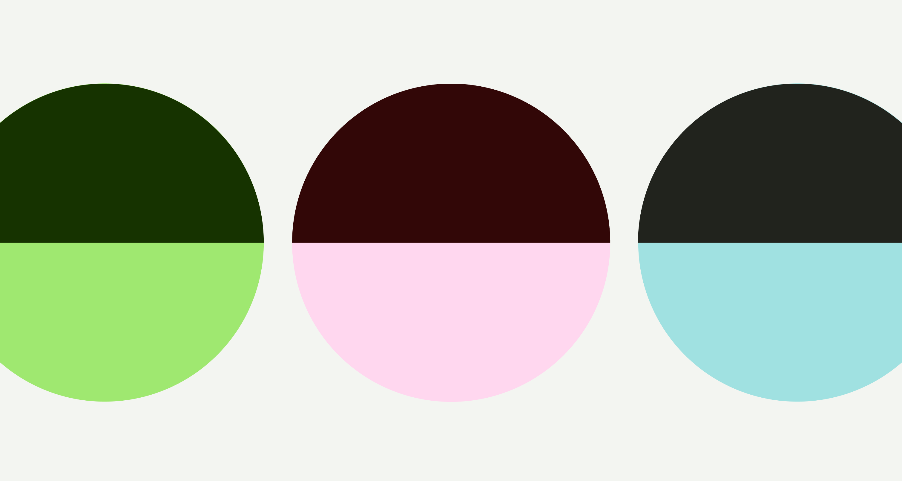
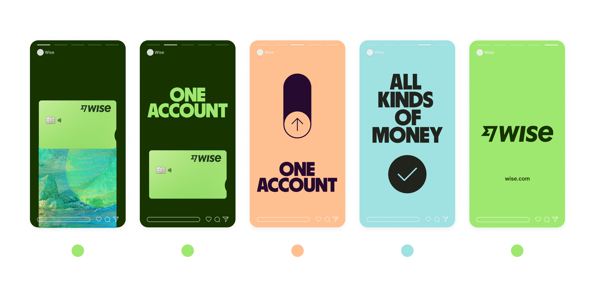
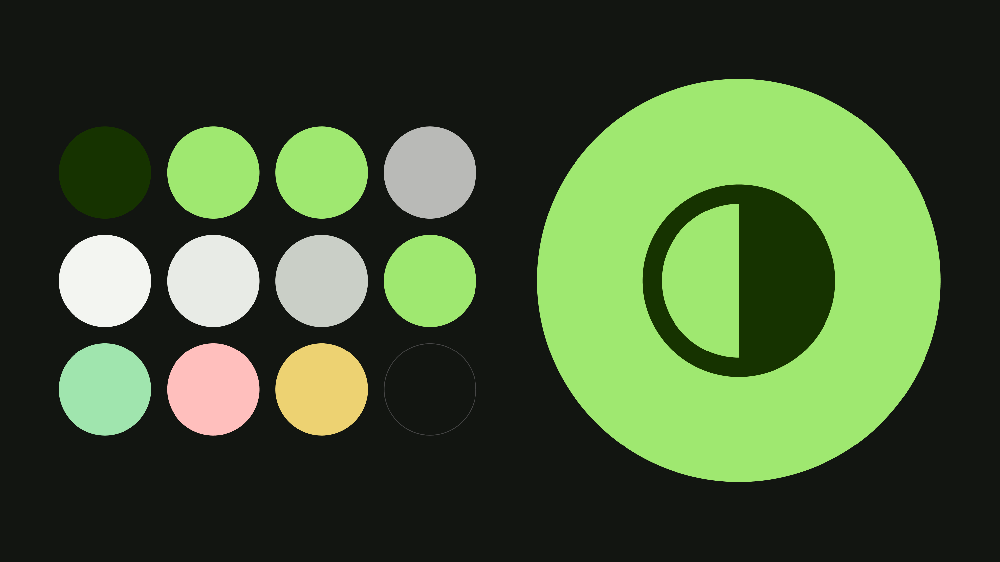

# Headspace Design Foundations

This guide covers the core tokens and guidelines of the Wise / Neptune Design System structure, **recoloured with the Headspace brand palette**. Colour is 100% Headspace (source: `live.standards.site/headspace/color`, updated September 2024); typography, spacing, radii, icons, and logo structure follow Wise / Neptune.

## 1. Colour System



Our palette is bright, hopeful, approachable, and visionary — hues that feel joyful and fresh, showcasing the spectrum of emotions.

### Core colours

Orange is our most-recognizable brand colour, inspired by the traditions of meditation and practice. Use orange freely, supported by white and dark grey.

#### Our Core Colours

| Color Name | Hex (Light) | Hex (Dark) | Token | Description |
| --- | --- | --- | --- | --- |
| Orange 200 | `#FF7300` | `` | `--hs-orange-200` | Primary brand colour. Use for key interactive accent surfaces. |
| Warm Grey 700 | `#2D2C2B` | `` | `--hs-warm-grey-700` | The "black" text colour, for text/icons and core interactivity. |
| White | `#FFFFFF` | `` | `--hs-white` | |

### Secondary colours

Add vibrancy to illustrations, layouts, and UI; often used as layout backgrounds. Introduce the secondary palette once orange is nicely established — think of it as a visual metaphor for getting closer, and more comfortable.

#### Secondary Colours

| Color Name | Hex (Light) | Hex (Dark) | Token | Description |
| --- | --- | --- | --- | --- |
| Yellow 200 | `#FFCE00` | `` | `--hs-yellow-200` | |
| Blue 200 | `#0061EF` | `` | `--hs-blue-200` | |
| Green 200 | `#01A652` | `` | `--hs-green-200` | |
| Pink 200 | `#FFA1CC` | `` | `--hs-pink-200` | |
| Purple 200 | `#9E65C6` | `` | `--hs-purple-200` | |
| Warm Grey 100 | `#F9F4F2` | `` | `--hs-warm-grey-100` | Light neutral background. |

#### Using secondary colours

Always start and end with orange. It's our first impression and our bye for now. Introduce the secondary palette when orange is nicely established — so the further someone gets through, say, a story, the more you can dial it up.



### Accent colours

Add depth to illustrations and UI elements — use sparingly to avoid diluting brand recognition. 400-level colours are shadow-only.

| Color Name | RGB | Hex | Token |
| --- | --- | --- | --- |
| Orange 100 | 255/165/0 | `#FFA500` | `--hs-orange-100` |
| Orange 300 | 252/85/0 | `#FC5500` | `--hs-orange-300` |
| Orange 400 (shadow only) | 247/41/0 | `#F72900` | `--hs-orange-400` |
| Yellow 100 | 255/225/79 | `#FFE14F` | `--hs-yellow-100` |
| Yellow 300 | 255/183/0 | `#FFB700` | `--hs-yellow-300` |
| Yellow 400 (shadow only) | 255/153/0 | `#FF9900` | `--hs-yellow-400` |
| Blue 100 | 0/164/255 | `#00A4FF` | `--hs-blue-100` |
| Blue 300 | 0/64/234 | `#0040EA` | `--hs-blue-300` |
| Blue 400 (shadow only) | 0/0/219 | `#0000DB` | `--hs-blue-400` |
| Green 100 | 49/204/102 | `#31CC66` | `--hs-green-100` |
| Green 300 | 2/135/62 | `#02873E` | `--hs-green-300` |
| Green 400 (shadow only) | 11/102/42 | `#0B662A` | `--hs-green-400` |
| Pink 100 | 255/202/231 | `#FFCAE7` | `--hs-pink-100` |
| Pink 300 | 255/118/184 | `#FF76B8` | `--hs-pink-300` |
| Pink 400 (shadow only) | 255/82/165 | `#FF52A5` | `--hs-pink-400` |
| Purple 100 | 173/133/209 | `#AD85D1` | `--hs-purple-100` |
| Purple 300 | 129/68/168 | `#8144A8` | `--hs-purple-300` |
| Purple 400 (shadow only) | 95/43/137 | `#5F2B89` | `--hs-purple-400` |
| Indigo 100 *[Sleep only]* | 84/49/165 | `#5431A5` | `--hs-indigo-100` |
| Indigo 200 *[Sleep only]* | 59/25/127 | `#3B197F` | `--hs-indigo-200` |
| Indigo 300 *[Sleep only]* | 40/20/102 | `#281466` | `--hs-indigo-300` |
| Indigo 400 *[Sleep only]* | 26/12/84 | `#1A0C54` | `--hs-indigo-400` |
| Winkle 100 *[Sleep only]* | 114/124/229 | `#727CE5` | `--hs-winkle-100` |
| Winkle 200 *[Sleep only]* | 102/102/204 | `#6666CC` | `--hs-winkle-200` |
| Winkle 300 *[Sleep only]* | 82/74/165 | `#524AA5` | `--hs-winkle-300` |
| Winkle 400 *[Sleep shadow only]* | 56/58/130 | `#383A82` | `--hs-winkle-400` |

### Type and colour

Our colour combos are purposefully complementary, striking, and accessible. They were made to match up, so let's keep them that way.

#### Good combinations (Type dos)

| Color Name | Hex | Token |
| --- | --- | --- |
| Orange 200 | `#FF7300` | `--hs-orange-200` |
| Yellow 200 | `#FFCE00` | `--hs-yellow-200` |
| Blue 200 | `#0061EF` | `--hs-blue-200` |
| Green 200 | `#01A652` | `--hs-green-200` |
| Pink 200 | `#FFA1CC` | `--hs-pink-200` |
| Purple 200 | `#9E65C6` | `--hs-purple-200` |
| Warm Grey 700 | `#2D2C2B` | `--hs-warm-grey-700` |
| White | `#FFFFFF` | `--hs-white` |

### Product colours

#### Content colours

Our content colours are based on neutral warm greys, so text stays clear and accessible while carrying a hint of the brand's warmth.

| Color Name | Hex (Light) | Hex (Dark) | Token | Description |
| --- | --- | --- | --- | --- |
| Content Primary | `#2D2C2B` | `#F9F4F2` | `--color-content-primary` | Use to emphasise primary content in relation to other elements nearby. |
| Content Secondary | `#63605D` | `#E2DED9` | `--color-content-secondary` | Use for most body text, and in supportive elements that give context to content that's close to it. |
| Content Tertiary | `#A8A5A0` | `#C6C1B9` | `--color-content-tertiary` | Use in form inputs for placeholders, and for the label that says a field is 'Optional'. Avoid using elsewhere. |
| Content Link | `#FF7300` | `#FFA500` | `--color-content-link` | Use for links and for external link icons that appear in line with link text. |

#### Interactive colours

Our interactive colours are used in interactive components and icons. Primary and accent colours use the core brand colours to stand out. The secondary and tertiary colours are more neutral, to support the visual hierarchy of the screen.

| Color Name | Hex (Light) | Hex (Dark) | Token | Description |
| --- | --- | --- | --- | --- |
| Interactive Primary | `#FF7300` | `#FFA500` | `--color-interactive-primary` | Conveys interactivity. Use for interactive elements, or for emphasising active items within an interactive list. |
| Interactive Accent | `#FF7300` | `#FF7300` | `--color-interactive-accent` | Use sparingly as a pop of accent colour in interactive elements. For example, the background for primary buttons. |
| Interactive Secondary | `#A8A5A0` | `#C6C1B9` | `--color-interactive-secondary` | Use for de-emphasised interactivity, like the borders on inputs and checkboxes, and the clear button on a search input. Do not use on text. |
| Interactive Control | `#2D2C2B` | `#2D2C2B` | `--color-interactive-control` | Use for text and icons that sit on an Orange 200 Interactive Accent surface. Keeps them visible when users switch to dark mode. |
| Interactive Contrast | `#FF7300` | `` | `` | Use for text and icons that sit on a Warm Grey 700 Interactive Primary surface. |

#### Background colours

Background colours are used for larger surface areas that are light enough to be overlayed with content and other components.

| Color Name | Hex (Light) | Hex (Dark) | Token | Description |
| --- | --- | --- | --- | --- |
| Background Screen | `#FFFFFF` | `#141313` | `--color-background-screen` | The lowest level background used in most screens. |
| Background Elevated | `#FFFFFF` | `#2D2C2B` | `--color-background-elevated` | Use for elevated surfaces that partially show the content behind it, like bottom sheets and sidebars. |
| Background Neutral | `#FF7300` | `#FFFFFF` | `--color-background-neutral` | Use for delineating areas without using borders, like neutral alerts and avatars. |
| Background Overlay | `#2D2C2B` | `#FFFFFF` | `--color-background-overlay` | Use for faintly darkening an area, for example on loading shimmers. |

#### Border colours

We use border colours to subtly separate different blocks of content.

| Color Name | Hex (Light) | Hex (Dark) | Token | Description |
| --- | --- | --- | --- | --- |
| Border Neutral | `#2D2C2B` | `#FFFFFF` | `--color-border-neutral` | Use in most separators, for example in the section header and tabs components. |
| Border Overlay | `#2D2C2B` | `#FFFFFF` | `--color-border-overlay` | Use on the edges of images to differentiate them from the background, such as flags in avatars. |

#### Sentiment colours

Our sentiment colours are used to indicate positive, negative, or warning. They're needed in components like alerts and error messages, but it's best to avoid using them elsewhere.

| Color Name | Hex (Light) | Hex (Dark) | Token | Description |
| --- | --- | --- | --- | --- |
| Sentiment Negative | `#F72900` | `#FFA1CC` | `--color-sentiment-negative` | Indicates negative sentiment, for example on error states or destructive actions (Orange 400). |
| Sentiment Positive | `#02873E` | `#31CC66` | `--color-sentiment-positive` | Indicates positive sentiment, for example in positive alerts (Green 300 / Green 100). |
| Sentiment Warning | `#FFB700` | `#FFE14F` | `--color-sentiment-warning` | Indicates warning sentiment, for example on alerts (Yellow 300 / Yellow 100). Use as a background only. |

#### Base colours

Base colours are useful colours that we can use in several different scenarios.

| Color Name | Hex (Light) | Hex (Dark) | Token | Description |
| --- | --- | --- | --- | --- |
| Base Contrast | `#FFFFFF` | `#141313` | `--color-contrast` | Use for copy on negative buttons. Turns dark on dark mode to keep elements visible. |
| Base Light | `#FFFFFF` | `#FFFFFF` | `--color-light` | Use in informational or interactive elements where white is needed. |
| Base Dark | `#141313` | `#141313` | `--color-dark` | Use in informational or interactive elements where a dark colour is needed (Warm Grey 800). |

### Neutral colours (Warm Grey)

Ground the palette; use across a variety of touchpoints alongside primary/secondary colours.

| Color Name | RGB | Hex | Token | Note |
| --- | --- | --- | --- | --- |
| Warm Grey 100 | 249/244/242 | `#F9F4F2` | `--hs-warm-grey-100` | Light neutral background |
| Warm Grey 200 | 226/222/217 | `#E2DED9` | `--hs-warm-grey-200` | |
| Warm Grey 300 | 198/193/185 | `#C6C1B9` | `--hs-warm-grey-300` | |
| Warm Grey 400 | 168/165/160 | `#A8A5A0` | `--hs-warm-grey-400` | |
| Warm Grey 500 | 99/96/93 | `#63605D` | `--hs-warm-grey-500` | |
| Warm Grey 600 | 68/66/63 | `#44423F` | `--hs-warm-grey-600` | |
| Warm Grey 700 | 45/44/43 | `#2D2C2B` | `--hs-warm-grey-700` | The "black" text colour |
| Warm Grey 800 | 20/19/19 | `#141313` | `--hs-warm-grey-800` | Darkest neutral / dark-mode screen |

### Colour palettes by context

- **Core Palette** (default): Orange 200, Warm Grey 700, White, Yellow 200, Blue 200, Green 200, Pink 200, Purple 200, Warm Grey 100.
- **Sleep Palette**: Winkle 200/300, Indigo 200/300, plus accents of Yellow 200, Pink 200, Blue 100/200, White.
- **Care Palette**: leads with Yellow 200, plus Blue 100/200, Orange 200, Pink 200, Purple 200.

Keep palettes context-locked — never mix Sleep (Indigo/Winkle) with Core-palette layouts.

### Theming

Our colours work equally well in dark mode.



### Colour accessibility

The brand is bright and vibrant, so type/colour pairing must stay high-contrast and accessible. Headspace targets WCAG 2.1 AA (4.5:1 minimum contrast ratio) and also evaluates against APCA.

### CSS custom properties

```css
:root {
  /* Primary */
  --hs-orange-200: #FF7300;
  --hs-warm-grey-700: #2D2C2B;
  --hs-white: #FFFFFF;

  /* Secondary */
  --hs-yellow-200: #FFCE00;
  --hs-blue-200: #0061EF;
  --hs-green-200: #01A652;
  --hs-pink-200: #FFA1CC;
  --hs-purple-200: #9E65C6;
  --hs-warm-grey-100: #F9F4F2;

  /* Accent */
  --hs-orange-100: #FFA500;  --hs-orange-300: #FC5500;  --hs-orange-400: #F72900;
  --hs-yellow-100: #FFE14F;  --hs-yellow-300: #FFB700;  --hs-yellow-400: #FF9900;
  --hs-blue-100:   #00A4FF;  --hs-blue-300:   #0040EA;  --hs-blue-400:   #0000DB;
  --hs-green-100:  #31CC66;  --hs-green-300:  #02873E;  --hs-green-400:  #0B662A;
  --hs-pink-100:   #FFCAE7;  --hs-pink-300:   #FF76B8;  --hs-pink-400:   #FF52A5;
  --hs-purple-100: #AD85D1;  --hs-purple-300: #8144A8;  --hs-purple-400: #5F2B89;

  /* Sleep only */
  --hs-indigo-100: #5431A5;  --hs-indigo-200: #3B197F;
  --hs-indigo-300: #281466;  --hs-indigo-400: #1A0C54;
  --hs-winkle-100: #727CE5;  --hs-winkle-200: #6666CC;
  --hs-winkle-300: #524AA5;  --hs-winkle-400: #383A82;

  /* Neutrals */
  --hs-warm-grey-200: #E2DED9;  --hs-warm-grey-300: #C6C1B9;
  --hs-warm-grey-400: #A8A5A0;  --hs-warm-grey-500: #63605D;
  --hs-warm-grey-600: #44423F;  --hs-warm-grey-800: #141313;

  /* Semantic product tokens (light) */
  --color-content-primary: #2D2C2B;
  --color-content-secondary: #63605D;
  --color-content-tertiary: #A8A5A0;
  --color-content-link: #FF7300;
  --color-interactive-primary: #FF7300;
  --color-interactive-accent: #FF7300;
  --color-interactive-secondary: #A8A5A0;
  --color-interactive-control: #2D2C2B;
  --color-background-screen: #FFFFFF;
  --color-background-elevated: #FFFFFF;
  --color-background-neutral: #FF7300;
  --color-border-neutral: #2D2C2B;
  --color-sentiment-negative: #F72900;
  --color-sentiment-positive: #02873E;
  --color-sentiment-warning: #FFB700;
}
```

> [!NOTE]
> The screenshots referenced throughout this guide (in `assets/`) are the original Wise product mockups and are **not** recoloured. Use them for layout and structure; apply the Headspace palette above for all colour.

## Typography

Our typographic system is built on legibility and accessibility. It's clear, bold, and — when we use our international glyphs — endlessly expressive.

### Using Fonts Locally

This skill includes the open-source **Inter** typeface files (Regular, Medium, SemiBold, Bold, ExtraBold) inside the `fonts/` directory.

To reference and load these fonts in your CSS, add the following `@font-face` definitions:

```css
@font-face {
font-family: 'Inter';
font-style: normal;
font-weight: 400;
font-display: swap;
src: url('../fonts/Inter-Regular.ttf') format('truetype');
}

@font-face {
font-family: 'Inter';
font-style: normal;
font-weight: 500;
font-display: swap;
src: url('../fonts/Inter-Medium.ttf') format('truetype');
}

@font-face {
font-family: 'Inter';
font-style: normal;
font-weight: 600;
font-display: swap;
src: url('../fonts/Inter-SemiBold.ttf') format('truetype');
}

@font-face {
font-family: 'Inter';
font-style: normal;
font-weight: 700;
font-display: swap;
src: url('../fonts/Inter-Bold.ttf') format('truetype');
}

@font-face {
font-family: 'Inter';
font-style: normal;
font-weight: 800;
font-display: swap;
src: url('../fonts/Inter-ExtraBold.ttf') format('truetype');
}
```

> [!NOTE]
> **Wise Sans** is a proprietary brand typeface. For designs requiring it, it must be loaded from authorized assets servers or substituted with a heavy display sans-serif alternative in test/development environments.

### Text styles

| Col 1 | Col 2 |
| --- | --- |
| __Wise Sans__ <br>__Heavy 56px -> 128px__ <br>Line height 85% <br>Letter spacing 0% <br>Paragraph spacing 20px -> 32px | Display 1 |
| __Wise Sans__ <br>__Heavy 50px -> 96px__ <br>Line height 85% <br>Letter spacing 0% <br>Paragraph spacing 20px -> 32px | Display 2 |
| __Wise Sans__ <br>__Heavy 46px -> 64px__ <br>Line height 85% <br>Letter spacing 0% <br>Paragraph spacing 20px -> 32px | Display 3 |
| __Wise Sans__ <br>__Heavy 34px -> 40px__ <br>Line height 85% <br>Letter spacing 0% <br>Paragraph spacing 20px -> 32px | Display 4 |
| __Inter__ <br>__Semi Bold 42px -> 78px__ <br>Line height 46px -> 82px <br>Letter spacing -3% <br>Paragraph spacing 26px -> 36px | Heading 1 |
| __Inter__ <br>__Semi Bold 37px -> 53px__ <br>Line height 41px -> 57px <br>Letter spacing -3% <br>Paragraph spacing 26px -> 24px | Heading 2 |
| __Inter__ <br>__Semi Bold 28px -> 44px__ <br>Line height 32px -> 40px <br>Letter spacing -1.5% -> -3% <br>Paragraph spacing 20px | Heading 3 |
| __Inter__ <br>__Semi Bold 24px -> 30px__ <br>Line height 34px -> 34px <br>Letter spacing -1.5% -> -2.5% <br>Paragraph spacing 20px | Heading 4 |
| __Inter__ <br>__Semi Bold 20px -> 26px__ <br>Line height 28px -> 32px <br>Letter spacing -1% -> -1.5% <br>Paragraph spacing 20px | Heading 5 |
| __Inter__ <br>__Semi Bold 18px -> 20px__ <br>Line height 26px -> 28px <br>Letter spacing -0.5% -> 0.5% <br>Paragraph spacing 16px | Body 1 Semi Bold |
| __Inter__ <br>__Regular 18px -> 20px__ <br>Line height 26px -> 28px <br>Letter spacing -0.5%<br>Paragraph spacing 16px | Body 1 Regular |
| __Inter__ <br>__Semi Bold 16px -> 18px__ <br>Line height 24px -> 26px <br>Letter spacing -0.5% -> 1.25% <br>Paragraph spacing 12px -> 16px | Body 2 Semi Bold |
| __Inter__ <br>__Regular 16px -> 18px__ <br>Line height 24px -> 26px <br>Letter spacing -0.5% -> 1.25% <br>Paragraph spacing 12px -> 16px | Body 2 Regular |
| __Inter__ <br>__Semi Bold 14px -> 16px__ <br>Line height 22px -> 24px <br>Letter spacing 1% -> 1.25% <br>Paragraph spacing 12px | Body 3 Semi Bold |
| __Inter__ <br>__Regular 14px -> 16px__ <br>Line height 22px -> 24px <br>Letter spacing 1% -> 1.25% <br>Paragraph spacing 12px | Body 3 Regular |
| __Inter__ <br>__Semi Bold Underlined 18px -> 20px__ <br>Line height 26px -> 28px <br>Letter spacing -0.5% -> 1% <br>Paragraph spacing 16px | Link 1 |
| __Inter__ <br>__Semi Bold Underlined 16px -> 18px__ <br>Line height 24px -> 26px <br>Letter spacing -0.5% -> 1.25% <br>Paragraph spacing 12px -> 16px | Link 2 |
| __Inter__ <br>__Semi Bold Underlined 14px -> 16px__ <br>Line height 22px -> 24px <br>Letter spacing 1% -> 1.25% <br>Paragraph spacing 12px -> 16px | Link 3 |

### Inter

Inter's simplicity, clarity and rounded forms make it the perfect functional typeface. Always default to Inter. Unless you're being expressive, use Inter to make sure you communicate easily with everyone, especially in product.

You should left-align or centre text in Inter. But right-align it if you're using a right-to-left language. And keep line lengths between 50 and 60 characters.

### Wise Sans

Wise Sans is our clean, bold, display typeface. It's loud, proud, and perfect for headlines. Use it for key success and selling moments to add extra bounce — success screens, success progress screens, and feature intro screens. Use sparingly.

## Spacing

Spacing tokens separate elements inside components and layout blocks — both horizontally, and vertically. Our spacing scale helps make things consistent, while also making content easier to scan in a screen layout.

### Foundational tokens

We use foundational tokens to set up all of our components and templates. They are used as a base for our semantic tokens.

| Name | Value |
| --- | --- |
| size-4 | 4px |
| size-8 | 8px |
| size-12 | 12px |
| size-16 | 16px |
| size-24 | 24px |
| size-32 | 32px |
| size-40 | 40px |
| size-48 | 48px |
| size-56 | 56px |
| size-64 | 64px |
| size-72 | 72px |
| size-80 | 80px |
| size-88 | 88px |
| size-96 | 96px |
| size-104 | 104px |
| size-112 | 112px |
| size-120 | 120px |
| size-128 | 128px |

### Accessibility scaling

We have a defined scale for accessibility so that when screens are increased in size our content dynamically grows.

| 100% | 85% | 130% | 155% |
| --- | --- | --- | --- |
| 4px | 3px | 5px | 6px |
| 8px | 7px | 10px | 12px |
| 12px | 10px | 16px | 19px |
| 16px | 14px | 21px | 25px |
| 24px | 20px | 31px | 37px |
| etc... | | | |

### Semantic tokens

So you know what space to use, and where, we use semantic tokens. These tokens are linked to our foundational tokens.

#### Horizontal

Horizontal spacing refers to elements that go next to each other.

| Name | Value |
| --- | --- |
| between-cards | size-12 |
| between-chips | size-8 |
| screen-mobile | size-24 |
| component-default | size-16 |

#### Vertical

Vertical spacing refers to how sections of a screen are separated, and to the spacing between components.

| Name | Value |
| --- | --- |
| between-text | size-8 |
| image-bottom | size-8 |
| display-text-bottom | size-16 |
| text-to-component | size-16 |
| content-to-button | size-24 |
| between-sections | size-32 |
| between-options | size-0 |
| component-default | size-16 |

## Radius

Radius (or radii) are the rounded corners in components, and other pieces of content. They give the experience a bolder and more expressive appearance.

### Desktop scale

| Name | Value |
| --- | --- |
| radius-small | 16px |
| radius-medium | 20px |
| radius-large | 30px |
| radius-x-large | 40px |
| radius-2x-large | 60px |

### Mobile scale

| Name | Value |
| --- | --- |
| radius-small | 10px |
| radius-medium | 16px |
| radius-large | 24px |
| radius-x-large | 32px |
| radius-2x-large | 48px |

## Icons

They're the ultimate shorthand — straightforward, simple, accessible. In most cases, icons sit on neutral backgrounds, and the icon colour depends on whether it is interactive or informational. There is also a white version designed to work against a neutral surface.

We have two different sizing rules for product and marketing. Icons can also be used outside of their functional boundaries to communicate key features in a more expressive manner.

## Logo

Colour is the first visual thing we remember, and a powerful asset in building brand recognition. Use the brand colour first, last, and for nearly everything in between. When deep into a marketing application, you can also apply the secondary palette to the logo, if it feels appropriate.

**Minimum logo sizes**

- Print — 6mm high
- Digital — 35px high

Ours requires one flag's worth of clear space in all directions. Placing the logo in the corner makes it nice and visible without taking up too much room, especially digitally.

## Transitions

Transitions occur when users move between screens starting a new flow or navigating within a journey. They help users navigate through the app creating a sense of continuation, and should always be unobtrusive and natural.

We support two main kinds of page transitions — **Upwards** (start of a new flow/action) and **Sideways** (continuation of a flow) — plus two supplementary modal transitions: **Modals** and **Bottom sheets**.
